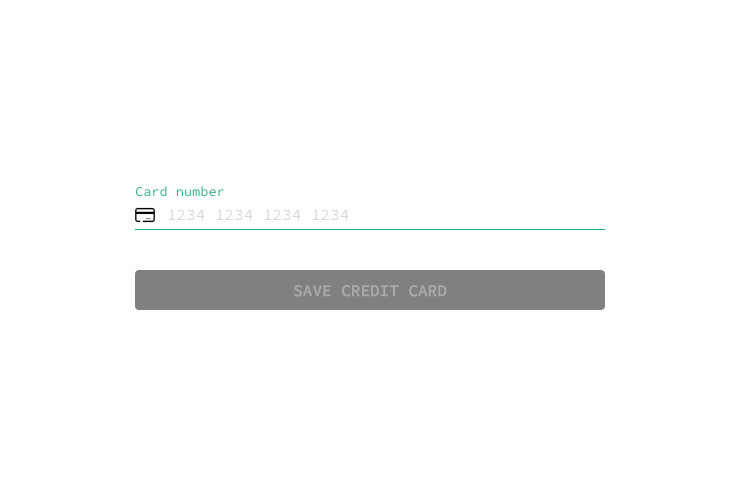
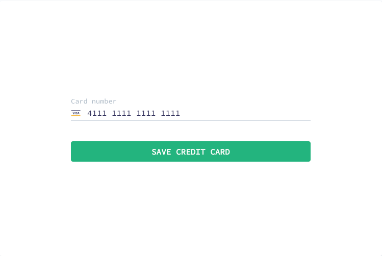

# Table of contents

<!-- toc -->

- [Task in a nutshell](#task-in-a-nutshell)
  * [Behaviour of the `Save credit card` button](#behaviour-of-the-save-credit-card-button)
  * [Behaviour of the `Card number` field](#behaviour-of-the-card-number-field)
  * [Check #1: Validity of the card number](#check-%231-validity-of-the-card-number)
  * [Check #2: Card Scheme detection](#check-%232-card-scheme-detection)
    + [Important considerations](#important-considerations)
- [How to submit](#how-to-submit)

<!-- tocstop -->

# Task in a nutshell

You task is to build a **production-ready** React application, that presents a form for collecting credit card number. 

When the form is loaded, it should look like this: 



When user enters credit card data, application view changes. Specifically, icon on the left side of the input field and the `Save credit card` button.

## Behaviour of the `Save credit card` button

This button turns active in one of the following cases:

1. [Credit card number is valid](#check-1-validity-of-the-card-number) AND [card scheme detected](#check-2-card-scheme-detection)
2. [Credit card number is valid](#check-1-validity-of-the-card-number), BUT card scheme can't be detected because of the outage of the backend service



## Behaviour of the `Card number` field

1. When card scheme not yet detected, the icon on the left side of the field should be: 
2. When [card scheme is detected](#check-2-card-scheme-detection), the icon on the left side of the field should from the `icon` field of the API response
3. When [card scheme is detected](#check-2-card-scheme-detection), but card number doesn't pass the [validity check](#check-1-validity-of-the-card-number), the icon on the left side of the field should be: 

**Hint**: All required icons are [here](./public)

## Check #1: Validity of the card number

The following algorithm can be used to check validity of a card number:

1. Starting from the right, replace each **second** digit of the number with a doubled value
2. Should doubling of a digit produce a 2-digit number, then add those 2 digits
3. Sum up all the digits

The card number is valid, if the sum is divisible by 10

**Example**: Let's check if `5237 2516 2477 8133` seems to be a valid credit card number.

1. Double each second digit: **10** 2 **6** 7 **4** 5 **2** 6 **4** 4 **14** 7 **16** 1 **6** 3
2. Add 2-digit numbers: 1. **1** 2 6 7 4 5 2 6 4 4 **5** 7 **7** 1 6 3
3. Sum up all the digits: 70

70 is divisible by 10, so `5237 2516 2477 8133` is a **valid** credit card number

## Check #2: Card Scheme detection

Card Scheme (Visa, MasterCard, JCB, etc) can be detected by the first digits of the card and the length of the card.

**Example**

| Scheme          | Ranges           | Number of Digits | Example number   |
|-----------------|------------------|---               |---
| American Express | 34,37            | 15              | 378282246310005  |
| JCB             | 3528-3589        | 16-19           | 3530111333300000 |
| Maestro         | 50, 56-58, 6     | 12-19           | 6759649826438453 |
| Visa            | 4                | 13,16,19        | 4012888888881881 |
| MasterCard      | 2221-2720, 51-55 | 16              | 5105105105105100 |

And there are [many others](https://en.wikipedia.org/wiki/Payment_card_number#Issuer_identification_number_.28IIN.29).

Your application is provided with a service, that supplies the data required for card scheme detection. The contract looks like this:

```
GET https://sumup-op-hiring-test.s3.eu-west-1.amazonaws.com/api-mock/cards-dictionary.json?request_id=1645556315
```

```json
{
  "type": "dictionary-card-schemes",
  "data": [
    {
      "id": "amex",
      "name": "American Express",
      "ranges": "34,37",
      "length": "15",
      "icon": "https://sumup-op-hiring-test.s3.eu-west-1.amazonaws.com/resources/amex.svg"
    },
    {
      "id": "jcb",
      "name": "JCB",
      "ranges": "3528-3589",
      "length": "16-19",
      "icon": "https://sumup-op-hiring-test.s3.eu-west-1.amazonaws.com/resources/jcb.svg"
    },
    {
      "id": "master",
      "name": "MasterCard",
      "ranges": "2221-2720, 51-55",
      "length": "16",
      "icon": "https://sumup-op-hiring-test.s3.eu-west-1.amazonaws.com/resources/master.svg"
    }
  ]
}
```

### Important considerations

 * application must be capable of coping with the service malfunction: no response (500 error), response with a delay or malformed response
Should that happen, your application should retry the request with a new `request_id`
 * `request_id` must be any int64 number

# How to submit

Create a work branch for yourself. When your solution is complete, create a pull request to the `main` branch.
